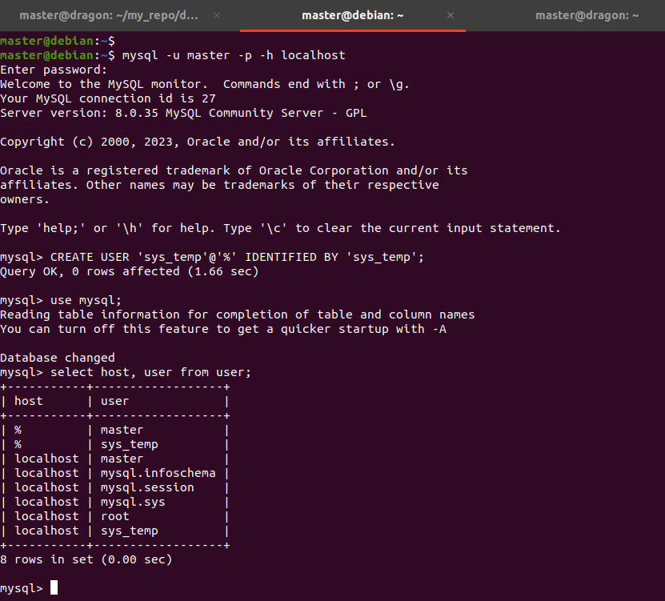
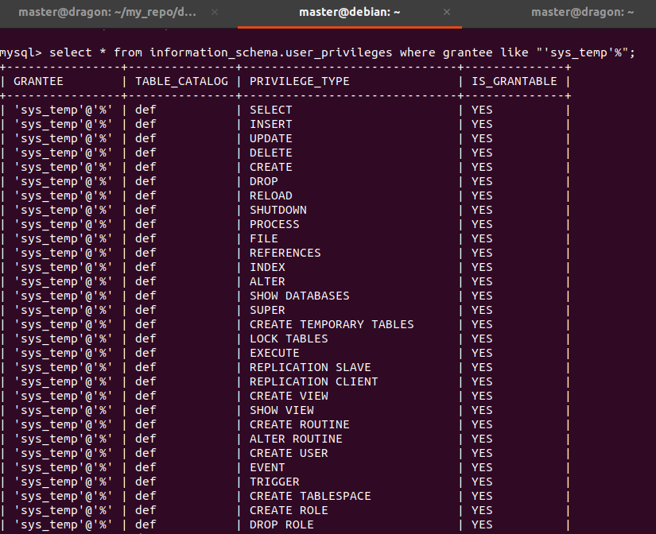
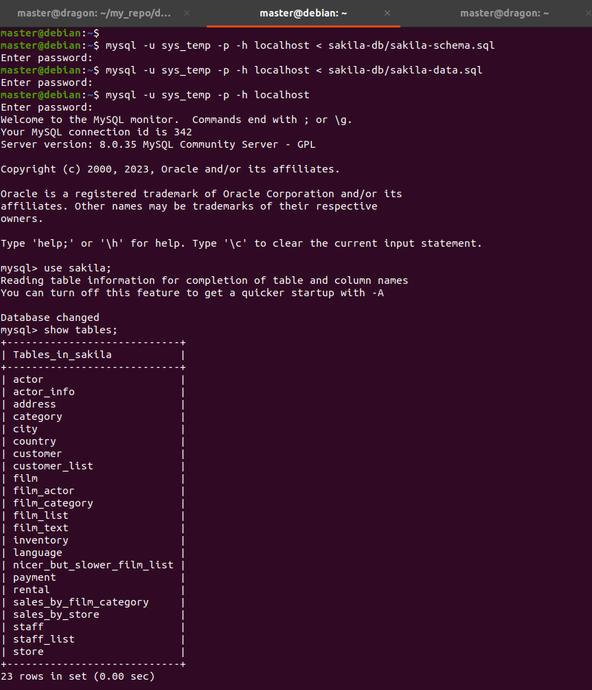

# Домашнее задание к занятию "`Работа с данными (DDL/DML)`" - `Аблогин Павел`

---

### Задание 1

1. `Поднял чистый инстанс MySQL версии 8.0.35`
2. `Создал учётную запись sys_temp и дал все права для этого пользователя.`
3. `Переподключился к базе данных от имени sys_temp`
4. `Скачал и восстановил дамп БД.`

```
#SQL-запросы для выполнения задания 1

CREATE USER 'sys_temp'@'%' IDENTIFIED BY 'sys_temp';

use mysql;

select host, user from user;

GRANT ALL PRIVILEGES ON *.* TO 'sys_temp'@'%' WITH GRANT OPTION;

select * from information_schema.user_privileges where grantee like "'sys_temp'%";

ALTER USER 'sys_temp'@'%' IDENTIFIED WITH mysql_native_password BY 'sys_temp';

use sakila;

show tables;

```

`Скриншоты выполнения задания 1`





---

### Задание 2

`Приведите ответ в свободной форме........`

1. `Заполните здесь этапы выполнения, если требуется ....`
2. `Заполните здесь этапы выполнения, если требуется ....`
3. `Заполните здесь этапы выполнения, если требуется ....`
4. `Заполните здесь этапы выполнения, если требуется ....`
5. `Заполните здесь этапы выполнения, если требуется ....`
6. 

```
Поле для вставки кода...
....
....
....
....
```

`При необходимости прикрепитe сюда скриншоты
`


---

### Задание 3

`Приведите ответ в свободной форме........`

1. `Заполните здесь этапы выполнения, если требуется ....`
2. `Заполните здесь этапы выполнения, если требуется ....`
3. `Заполните здесь этапы выполнения, если требуется ....`
4. `Заполните здесь этапы выполнения, если требуется ....`
5. `Заполните здесь этапы выполнения, если требуется ....`
6. 

```
Поле для вставки кода...
....
....
....
....
```

`При необходимости прикрепитe сюда скриншоты
`

### Задание 4

`Приведите ответ в свободной форме........`

1. `Заполните здесь этапы выполнения, если требуется ....`
2. `Заполните здесь этапы выполнения, если требуется ....`
3. `Заполните здесь этапы выполнения, если требуется ....`
4. `Заполните здесь этапы выполнения, если требуется ....`
5. `Заполните здесь этапы выполнения, если требуется ....`
6. 

```
Поле для вставки кода...
....
....
....
....
```

`При необходимости прикрепитe сюда скриншоты
`
